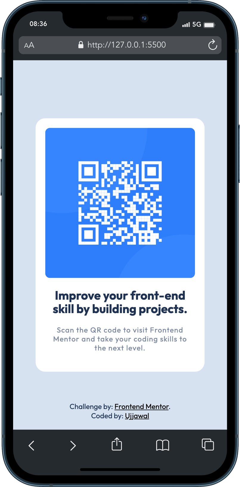
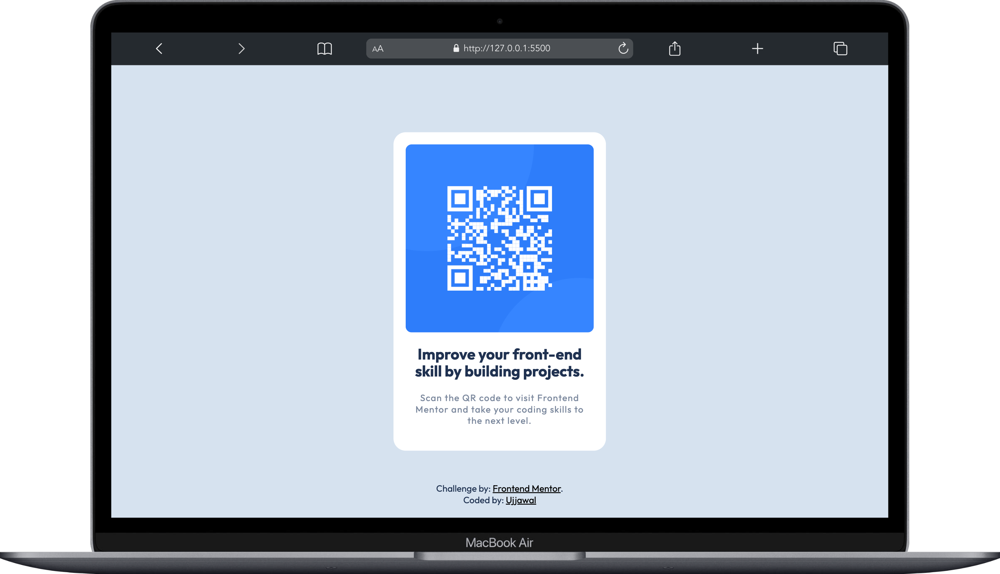

# Frontend Mentor - QR code component solution

This is a solution to the [QR code component challenge on Frontend Mentor](https://www.frontendmentor.io/challenges/qr-code-component-iux_sIO_H). Frontend Mentor challenges help you improve your coding skills by building realistic projects.

## Table of contents

- [Frontend Mentor - QR code component solution](#frontend-mentor---qr-code-component-solution)
  - [Table of contents](#table-of-contents)
  - [Overview](#overview)
    - [Screenshot](#screenshot)
      - [Mobile View](#mobile-view)
      - [Desktop View](#desktop-view)
  - [Built with](#built-with)
  - [Useful resources](#useful-resources)
  - [Acknowledgments](#acknowledgments)

## Overview

This project is a solution to the QR Code Component challenge on Frontend Mentor. The primary objective of this project is to faithfully replicate the provided design and ensure its responsiveness across various screen sizes.

### Screenshot

#### Mobile View

  

#### Desktop View

  

## Built with

- Semantic HTML5 markup
- CSS properties and media queries
- Flexbox
- position

## Useful resources

- [CSS Media Query](https://css-tricks.com/a-complete-guide-to-css-media-queries/)

## Acknowledgments

I would like to express my gratitude to [Frontend Mentor](https://www.frontendmentor.io/home) for this challenge. It was a fantastic experience.  
**[Frontend Mentor](https://www.frontendmentor.io/)**: Thank you for providing challenging and educational projects for developers.
